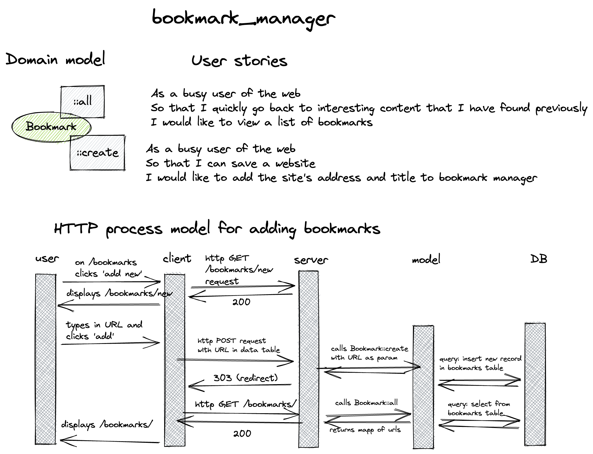

# Bookmark Manager

Makers Academy week 4 pairing challenge. The goal of this project is **I can build a web app that uses a database**.

## Getting started

`https://github.com/almorcrette/bookmark-manager.git`
`command_to_install_dependencies` (e.g. `bundle`)

Setting up the database:
1. Connect to `psql`
2. Create the database using the `psql` command `CREATE DATABASE bookmark_manager;`
3. Connect to the database using the `qsql` command `\c bookmark_manager;`
4. Run the query saved in the file `./db/migrations/01_create_bookmarks_table.sql`

## Usage

`command_to_start` (e.g. `rackup` or `rails s`)
Navigate to `http://localhost:4567/`

## Running tests

`test_command` (e.g. `rspec`)

## File manifest

## Project approach

### Website specification

The website will have the following specification:
* Show a list of bookmarks
* Add new bookmarks
* Delete bookmarks
* Update bookmarks
* Comment on bookmarks
* Tag bookmarks into categories
* Filter bookmarks by tag
* Users are restricted to manage only their own bookmarks

#### List of bookmarks

----------------------------------------------

At the barest minimum, it should contain a description of what the code does, how to install it, how to use it and how to run its tests. In addition, READMEs often include other information such as:

- Configuration instructions
- A file manifest (list of files included)
- Copyright and licensing information
- Contact information for the distributor or programmer
- Known bugs
- Troubleshooting
- Credits and acknowledgments
- A changelog (usually for programmers)
- A news section (usually for users)
